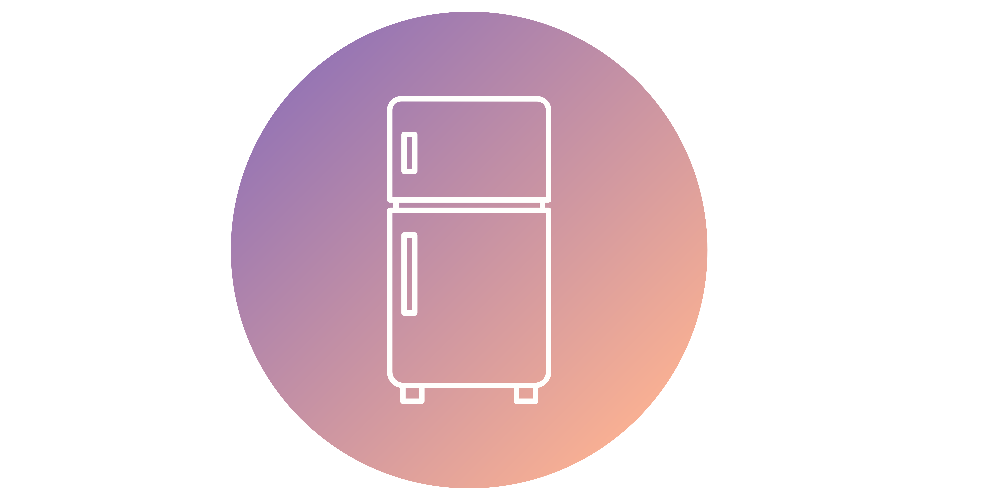
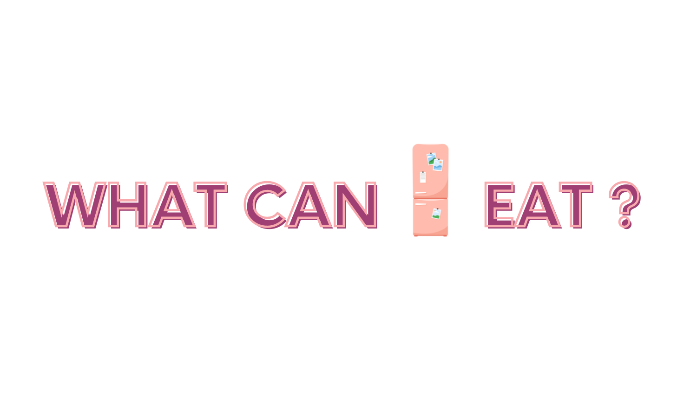

Rails app generated with a [Le Wagon's Rails template](https://github.com/lewagon/rails-templates), using PostgreSQL, Sassy CSS, Bootstrap and Stimulus, to create an app that supplies recipes to users and their ingredients. Users can search and filter for recipes by ingredients, dietary requirements and sort by rating; leave reviews; create friendships, sending invites and accepting or rejecting others' invites; save bookmarks; add ingredients from home to an online pantry, where they can then incorporate those ingredients into their recipe search, and chat to other users.

Equally created by A. Agozzino, J. Dedman, I. Peroni and F. Sandford.
